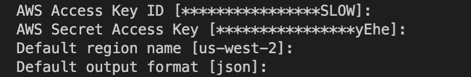

# AWS S3 Template

## SET AWS CLI environment
```
aws configure
```


## How to get Credentials
 - Visit Security credentials TAB in Identity and Access Management(IAM) 
 - Create access key
 - Get access key ID and secret key